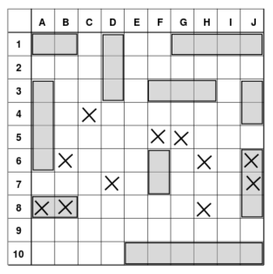

# Battleship

Develop with Rust the "Battleship" game in which the user plays against the computer.
To play, you need two <u><b>tables</b></u> of varying sizes from 10x10 up to 20x20.
The squares of the table are identified by pairs of coordinates, corresponding to row and column; they say letters for the columns and numbers for the rows (so the cells are A1, B6, and so on).

## Ships

The initialization of the game involves the random positioning of the <u><b>ships</b></u> in the game grids, both that of the PC and that of the user.
The ships to be placed will be according to the size of the grid (e.g. 10x10 = 10 ships) distributed as follows:

- 1 <b>aisle</b> of 5 (aircraft carrier)
- 1/5 ships of 4 (<b>battleships</b>)
- 1/5 ships of 3 (<b>cruiser</b>)
- 2/5 of 2 ships (<b>torpedo boat</b>)
  to complete the total number of ships, <b>submarines</b> (from 1 space)

A "ship" occupies a number of adjacent squares in a straight line (horizontal or vertical) on the board.
Two ships cannot touch each other.

## Gameplay

Once the ships proceed, the game is turn based.
Once it shoots the user, once it shoots the computer.
On his turn the user "fires a shot" by declaring a square (for example, "B5") and it is therefore necessary to develop the code that checks if a ship has been hit and if it has been hit, if it has been sunk.
In the event of a sunken ship, the information must be communicated to the user.
The computer always randomly (develop "at the moment" an "artificial intelligence")
The player who first sinks all of the opponent's ships wins.
